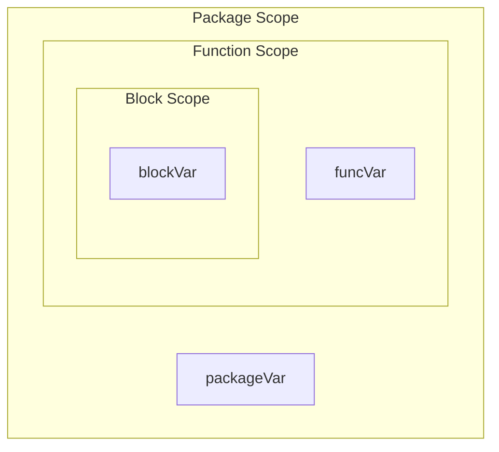
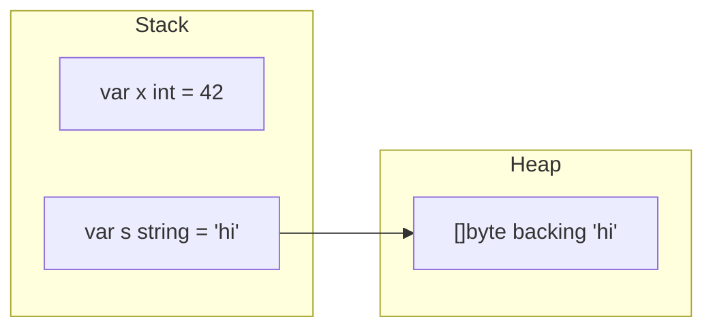

# Go Fundamentals

> **Category:** fundamentals | **Level:** beginner | **Module:** `01-fundamentals`

## Overview

Master the building blocks of Go: variables, constants, data types, operators, scope, and shadowing. This is where every Go journey begins.

## Learning Objectives

- Declare and initialize variables using `var` and `:=`
- Understand Go's static type system and zero values
- Use constants and iota for enumerations
- Apply operators and understand type conversions
- Recognize scope rules and variable shadowing pitfalls

## Theory

Go is a statically typed, compiled language designed for simplicity, readability, and concurrency. Every variable has a type known at compile time, and every type has a **zero value**.

### Variables & Constants

```go
var name string = "Go"   // explicit type
age := 15                  // type inference (short declaration)
const Pi = 3.14159
const (
    StatusOK = 200
    StatusNotFound = 404
)
```

### Data Types

| Category | Types |
|----------|-------|
| Boolean | `bool` |
| Numeric | `int`, `int8`–`int64`, `uint`, `float32`, `float64`, `complex64`, `complex128` |
| String | `string` (immutable UTF-8 byte sequence) |
| Derived | arrays, slices, maps, structs, pointers, functions, interfaces, channels |

### Scope & Shadowing



**Shadowing** occurs when an inner declaration hides an outer variable with the same name. This is a common source of bugs:

```go
x := 1
if true {
    x := 2  // shadows outer x
    fmt.Println(x) // 2
}
fmt.Println(x) // 1
```

## Memory Diagram



Small values live on the stack. Escape analysis determines whether the compiler moves values to the heap.

## Code Examples

```bash
go run ./01-fundamentals/examples/
```

## Complexity Analysis

| Operation | Time | Space |
|-----------|------|-------|
| Variable assignment | O(1) | O(1) |
| Type conversion | O(1) | O(1) |

## Exercises

See `exercises/` — implement a CLI temperature converter and a constant-based enum for HTTP status codes.

## Interview Questions

See `interview.md` and [148-interview-preparation](../148-interview-preparation/go-interview-questions/beginner/001-variables-and-types.md).

## Related Modules

- Next: [02-types-system](../02-types-system/README.md)
- Then: [03-control-flow](../03-control-flow/README.md)
