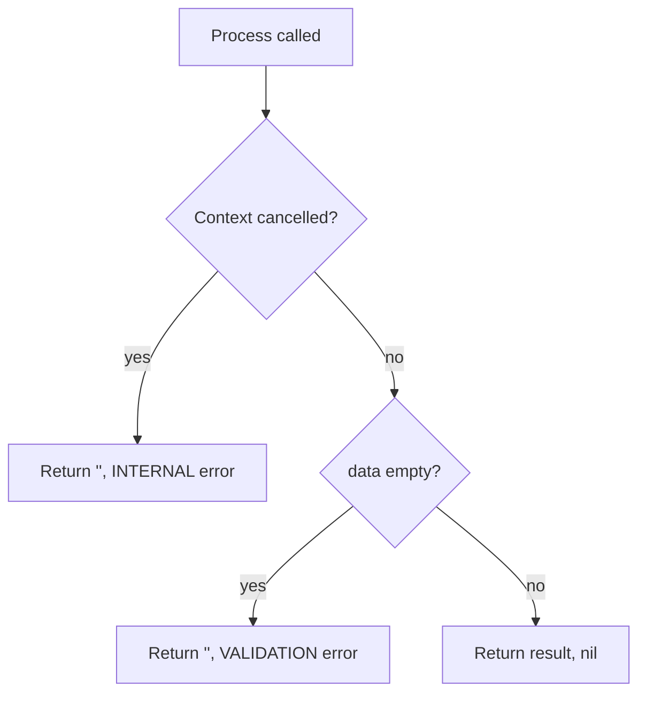
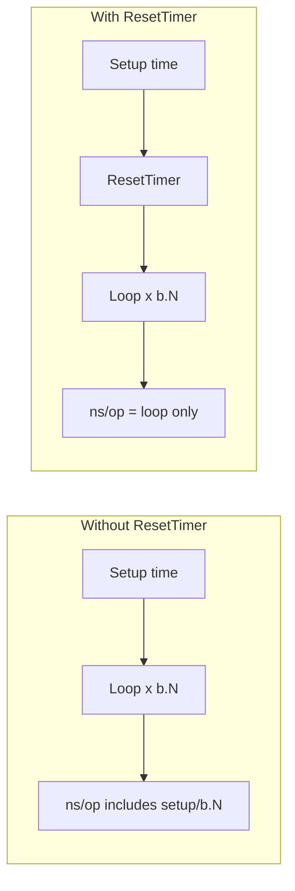
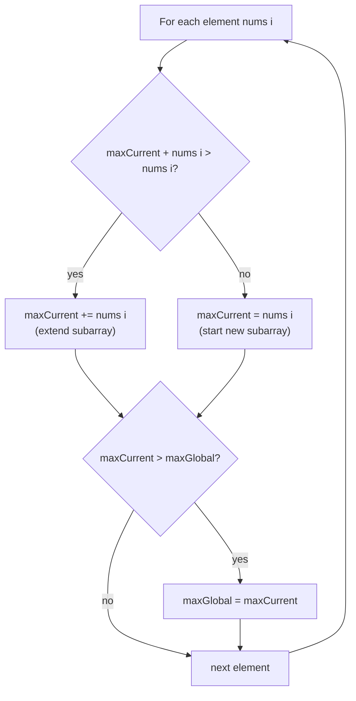

# Go Fundamentals — Exercises

## Exercise 1: Fundamentals

Implement the core concept from scratch without looking at solutions.

**Requirements:**

- Write idiomatic Go code
- Include error handling
- Add at least 3 unit tests

## Exercise 2: Production Patterns

Extend your implementation with:

- Context support
- Structured logging
- Graceful error wrapping

### Context & failure handling (reference)

Exercise 2 solution lives in `solutions/exercise2.go`. It demonstrates how production Go code handles **cancellation** and **validation failures** using `context.Context` and structured errors from `pkg/apperrors`.

#### Source: `Exercise2Service.Process`

```go
func (s *Exercise2Service) Process(ctx context.Context, data string) (string, error) {
	select {
	case <-ctx.Done():
		return "", apperrors.Wrap(ctx.Err(), apperrors.CodeInternal, "Go Fundamentals processing cancelled")
	default:
	}
	if data == "" {
		return "", apperrors.New(apperrors.CodeValidation, "data is required")
	}
	return fmt.Sprintf("[%s] processed: %s", s.Topic, data), nil
}
```

#### Flow



#### Failure code examples

**1. Validation failure** — empty input (`CodeValidation`)

```go
svc := &solutions.Exercise2Service{Topic: "Go Fundamentals"}

out, err := svc.Process(context.Background(), "")
// out == ""
// err  == VALIDATION: data is required
```

Use `apperrors.IsCode(err, apperrors.CodeValidation)` in handlers to return HTTP 400.

**2. Context cancellation** — caller cancelled or timed out (`CodeInternal`)

```go
ctx, cancel := context.WithCancel(context.Background())
cancel() // simulate shutdown or client disconnect

out, err := svc.Process(ctx, "hello")
// out == ""
// err  == INTERNAL: Go Fundamentals processing cancelled: context canceled
```

**3. Context timeout**

```go
ctx, cancel := context.WithTimeout(context.Background(), 1*time.Nanosecond)
defer cancel()
time.Sleep(2 * time.Millisecond) // exceed deadline

out, err := svc.Process(ctx, "hello")
// err wraps context.DeadlineExceeded
```

**4. Success path**

```go
out, err := svc.Process(context.Background(), "hello")
// out == "[Go Fundamentals] processed: hello"
// err == nil
```

#### Error codes (`pkg/apperrors`)

| Code | When to use | HTTP mapping (typical) |
|------|-------------|------------------------|
| `CodeValidation` | Bad client input | 400 Bad Request |
| `CodeInternal` | Cancelled, timeout, unexpected failure | 500 Internal Server Error |
| `CodeNotFound` | Resource missing | 404 Not Found |
| `CodeUnauthorized` | Auth failed | 401 Unauthorized |

#### Key patterns to apply in your solution

1. Pass `context.Context` as the **first parameter** of functions that do I/O or long work.
2. Check `ctx.Done()` early — stop work when the caller cancels.
3. Return `(result, error)` — use `nil` error on success.
4. Use structured errors with codes so HTTP/gRPC layers can map them consistently.
5. Wrap underlying errors with `apperrors.Wrap` to preserve the root cause for logs.

Run tests for Exercise 2:

```bash
go test -v -run TestExercise2 ./01-fundamentals/exercises/solutions/
```

## Exercise 3: Performance

- Write benchmarks
- Compare at least 2 approaches
- Document complexity analysis

### Benchmark test code — line-by-line (`exercise3_bench_test.go`)

Benchmarks measure **how fast** code runs. Go runs the benchmark function many times and reports **nanoseconds per operation** (`ns/op`).

#### Benchmark 1: `BenchmarkCelsiusToFahrenheit`

```go
package solutions_test

import (
	"testing"

	"github.com/go-mastery-roadmap/go-mastery-roadmap/01-fundamentals/exercises/solutions"
)

func BenchmarkCelsiusToFahrenheit(b *testing.B) {
	b.ResetTimer()
	for i := 0; i < b.N; i++ {
		_, _ = solutions.CelsiusToFahrenheit(100)
	}
}
```

| Line | Code | Detailed explanation |
|------|------|----------------------|
| 1 | `package solutions_test` | Test/benchmark files use `solutions_test` (external test package). This imports `solutions` like a real consumer would — good practice for testing public API. |
| 3–7 | `import (...)` | `"testing"` provides `*testing.B` for benchmarks. The module import gives access to `solutions.CelsiusToFahrenheit`. |
| 9 | `func BenchmarkCelsiusToFahrenheit(b *testing.B)` | **Naming rule:** must start with `Benchmark` + exported name. Go's test runner discovers this automatically when you run `go test -bench=.`. |
| 9 | `b *testing.B` | Benchmark controller. Go sets `b.N` (iteration count), tracks elapsed time, memory allocations, and exposes methods like `ResetTimer()`, `StopTimer()`, `ReportAllocs()`. |
| 10 | `b.ResetTimer()` | **Resets the benchmark clock to zero.** Use after any setup work so setup time is **not** counted in the result. In this benchmark there is no setup before the loop, so `ResetTimer()` has little effect here — but it is idiomatic to call it right before the timed loop. |
| 11 | `for i := 0; i < b.N; i++` | Go increases `b.N` until the benchmark runs long enough (~1 second) for stable timing. This loop runs your code `b.N` times. Example: `b.N` might be `50000000` for a tiny function. |
| 12 | `_, _ = solutions.CelsiusToFahrenheit(100)` | Calls the function under test with input `100` (°C). `_, _` discards both return values (result and error) because we only measure speed, not correctness. Use unit tests for correctness; benchmarks for performance. |
| 12 | `100` | Fixed input keeps each iteration consistent so results are comparable across runs and machines. |

#### Benchmark 2: `BenchmarkSumInts` (setup + `ResetTimer`)

```go
func BenchmarkSumInts(b *testing.B) {
	data := make([]int, 1000)
	for i := range data {
		data[i] = i
	}
	b.ResetTimer()
	for i := 0; i < b.N; i++ {
		_, _ = solutions.SumInts(data)
	}
}
```

| Line | Code | Detailed explanation |
|------|------|----------------------|
| 17 | `data := make([]int, 1000)` | **Setup (not timed):** allocates a slice of 1000 integers. This happens **once** before the benchmark loop. |
| 18–20 | `for i := range data { data[i] = i }` | Fills the slice with `0, 1, 2, ... 999`. Still setup — preparing realistic input. |
| 21 | `b.ResetTimer()` | **Critical here.** Setup (allocation + filling 1000 elements) can take microseconds. Without `ResetTimer()`, that setup time would be divided across `b.N` iterations and **skew** the `ns/op` number. After `ResetTimer()`, only the loop body is measured. |
| 22–24 | `for i := 0; i < b.N; i++ { ... }` | Timed section: calls `SumInts` `b.N` times with the same pre-built slice. Reusing `data` avoids measuring allocation inside the loop — we benchmark **SumInts**, not `make` every iteration. |

#### Why `b.ResetTimer()` matters



#### Related `testing.B` methods

| Method | Purpose |
|--------|---------|
| `b.ResetTimer()` | Zero elapsed time — call after setup, before timed loop |
| `b.StopTimer()` | Pause timing (e.g. inside loop for expensive debug logging) |
| `b.StartTimer()` | Resume after `StopTimer()` |
| `b.ReportAllocs()` | Include `allocs/op` in output (memory allocations per iteration) |

Example with allocation reporting:

```go
func BenchmarkSumIntsAllocs(b *testing.B) {
	data := make([]int, 1000)
	for i := range data {
		data[i] = i
	}
	b.ReportAllocs()
	b.ResetTimer()
	for i := 0; i < b.N; i++ {
		_, _ = solutions.SumInts(data)
	}
}
```

#### Run benchmarks

From repo root:

```bash
# Run all benchmarks in this package
go test -bench=. ./01-fundamentals/exercises/solutions/

# Run one benchmark
go test -bench=BenchmarkCelsiusToFahrenheit ./01-fundamentals/exercises/solutions/

# Show memory allocations per op
go test -bench=. -benchmem ./01-fundamentals/exercises/solutions/
```

#### Example output (interpretation)

```text
BenchmarkCelsiusToFahrenheit-8    1000000000    0.25 ns/op
BenchmarkSumInts-8                    5000000    245 ns/op
```

| Field | Meaning |
|-------|---------|
| `BenchmarkCelsiusToFahrenheit-8` | Benchmark name + `GOMAXPROCS` (8 logical CPUs) |
| `1000000000` | `b.N` — iterations executed |
| `0.25 ns/op` | Average nanoseconds per loop iteration |
| `-benchmem` adds | `allocs/op` (allocations) and `B/op` (bytes allocated) |

#### Compare two approaches (Exercise 3 goal)

Write two benchmark functions (e.g. `BenchmarkSumLoop` vs `BenchmarkSumBuiltin`) and compare `ns/op` with:

```bash
go test -bench=. -benchmem ./01-fundamentals/exercises/solutions/ | benchstat
```

(`benchstat` is from `golang.org/x/perf/cmd/benchstat` — optional tool for comparing runs.)

#### Complexity notes for these benchmarks

| Function | Time | Space | Notes |
|----------|------|-------|-------|
| `CelsiusToFahrenheit` | O(1) | O(1) | Fixed arithmetic — extremely fast |
| `SumInts` | O(n) | O(1) | n = len(data); linear scan of slice |

## Exercise 4: Interview Challenge

Solve the problem in `interview-challenge.go` within 30 minutes **before** opening `solutions/interview-challenge-solution.go`.

### Problem: Maximum Subarray Sum (Kadane's Algorithm)

Given an integer slice, find the **largest sum** of any **contiguous subarray** (elements next to each other).

**Example**

```text
Input:  [-2, 1, -3, 4, -1, 2, 1, -5, 4]
                  ^^^^^^^^^^^^^^^
                  best subarray
Output: 6   (because 4 + (-1) + 2 + 1 = 6)
```

**Requirements (from stub)**

- O(n) time
- Handle edge cases (empty slice, all negative, single element)
- Write tests

**Your starting file:** `interview-challenge.go`

```go
func InterviewChallenge(input []int) int {
	// TODO: Your implementation here
	_ = input
	return 0
}
```

### Solution walkthrough (`interview-challenge-solution.go`)

```go
func InterviewChallengeSolution(nums []int) int {
	if len(nums) == 0 {
		return 0
	}
	maxCurrent, maxGlobal := nums[0], nums[0]
	for i := 1; i < len(nums); i++ {
		if maxCurrent+nums[i] > nums[i] {
			maxCurrent += nums[i]
		} else {
			maxCurrent = nums[i]
		}
		if maxCurrent > maxGlobal {
			maxGlobal = maxCurrent
		}
	}
	return maxGlobal
}
```

#### Line-by-line explanation

| Line | Code | Explanation |
|------|------|-------------|
| 6–8 | `if len(nums) == 0 { return 0 }` | **Edge case:** empty slice → no subarray → sum is `0`. |
| 9 | `maxCurrent, maxGlobal := nums[0], nums[0]` | Initialize both trackers to the first element. `maxCurrent` = best sum ending **at current position**. `maxGlobal` = best sum seen **anywhere** so far. |
| 10 | `for i := 1; i < len(nums); i++` | Loop from second element — first element already handled. |
| 11–15 | `if maxCurrent+nums[i] > nums[i]` | **Core decision:** extend the previous subarray, or start fresh at `nums[i]`? If adding to the running sum beats starting over, extend; else reset `maxCurrent` to `nums[i]`. |
| 11 | `maxCurrent+nums[i] > nums[i]` | Equivalent to `maxCurrent > 0` when extending — only extend if the running sum helps. |
| 12 | `maxCurrent += nums[i]` | Extend the contiguous subarray. |
| 14 | `maxCurrent = nums[i]` | Previous sum was harmful — start a new subarray at index `i`. |
| 16–18 | `if maxCurrent > maxGlobal { maxGlobal = maxCurrent }` | Update global best if the current-ending subarray is the new maximum. |
| 20 | `return maxGlobal` | Answer: largest contiguous sum in the whole slice. |

#### Visual trace (example input)

```text
nums:        [-2,  1, -3,  4, -1,  2,  1, -5,  4]
index:         0   1   2   3   4   5   6   7   8

i=0 (init):  maxCurrent=-2, maxGlobal=-2
i=1:         extend? -2+1=-1 vs 1 → start fresh → maxCurrent=1,  maxGlobal=1
i=2:         extend? 1+(-3)=-2 vs -3 → start fresh → maxCurrent=-3, maxGlobal=1
i=3:         extend? -3+4=1 vs 4 → start fresh → maxCurrent=4,  maxGlobal=4
i=4:         extend? 4+(-1)=3 vs -1 → extend     → maxCurrent=3,  maxGlobal=4
i=5:         extend? 3+2=5 vs 2 → extend          → maxCurrent=5,  maxGlobal=5
i=6:         extend? 5+1=6 vs 1 → extend          → maxCurrent=6,  maxGlobal=6  ← answer
i=7:         extend? 6+(-5)=1 vs -5 → start fresh  → maxCurrent=-5, maxGlobal=6
i=8:         extend? -5+4=-1 vs 4 → start fresh    → maxCurrent=4,  maxGlobal=6

return 6
```

#### Algorithm flow (Kadane's)



#### Edge cases to test

| Input | Expected | Why |
|-------|----------|-----|
| `[]` | `0` | Empty slice |
| `[-1]` | `-1` | Single element |
| `[-2, -3, -1]` | `-1` | All negative — best is the least bad |
| `[5, 4, -1, 7, 8]` | `23` | Whole array is best |
| `[-2, 1, -3, 4, -1, 2, 1, -5, 4]` | `6` | Classic mixed case |

#### Complexity

| | |
|---|---|
| **Time** | O(n) — one pass through the slice |
| **Space** | O(1) — only two integer variables |

#### Test code (`interview-challenge-solution_test.go`)

```go
func TestInterviewChallengeSolution(t *testing.T) {
	got := solutions.InterviewChallengeSolution([]int{-2, 1, -3, 4, -1, 2, 1, -5, 4})
	if got != 6 {
		t.Fatalf("got %d want 6", got)
	}
}
```

| Line | Explanation |
|------|-------------|
| `got := solutions.InterviewChallengeSolution(...)` | Calls the solution with the classic example. |
| `if got != 6` | Expected maximum contiguous sum is **6**. |
| `t.Fatalf(...)` | Fail immediately with a clear message — standard table-driven tests often add more rows. |

**Improvement for your own tests:** use a table like Exercise 1:

```go
tests := []struct {
	name string
	in   []int
	want int
}{
	{"classic", []int{-2, 1, -3, 4, -1, 2, 1, -5, 4}, 6},
	{"empty", nil, 0},
	{"all negative", []int{-2, -3, -1}, -1},
}
```

#### Run the interview challenge test

```bash
go test -v -run TestInterviewChallengeSolution ./01-fundamentals/exercises/solutions/
```

#### Interview follow-ups (with answers)

Use these after solving the base problem — interviewers often go deeper.

---

**Follow-up 1: Return the subarray indices, not just the sum**

**Question:** Modify the solution to return `(start, end)` indices of the maximum subarray.

**Answer:** Track `start`, `end`, and `tempStart` while updating `maxCurrent` and `maxGlobal`. When you reset `maxCurrent = nums[i]`, set `tempStart = i`. When `maxGlobal` improves, copy `start = tempStart`, `end = i`.

```go
func MaxSubarrayIndices(nums []int) (maxSum, start, end int) {
	if len(nums) == 0 {
		return 0, -1, -1
	}
	maxCurrent, maxGlobal := nums[0], nums[0]
	start, end, tempStart = 0, 0, 0
	for i := 1; i < len(nums); i++ {
		if maxCurrent+nums[i] > nums[i] {
			maxCurrent += nums[i]
		} else {
			maxCurrent = nums[i]
			tempStart = i
		}
		if maxCurrent > maxGlobal {
			maxGlobal = maxCurrent
			start, end = tempStart, i
		}
	}
	return maxGlobal, start, end
}
```

**Example:** `[-2,1,-3,4,-1,2,1,-5,4]` → sum `6`, indices `3..6` (values `4,-1,2,1`).

---

**Follow-up 2: Brute force first — then optimize**

**Question:** How would you solve it with O(n²)? Why is Kadane's better?

**Answer:** Check every `(i, j)` pair where `i <= j`, sum `nums[i..j]`, track max. There are O(n²) pairs.

```go
// O(n²) — interview starting point, not production
func MaxSubarrayBruteForce(nums []int) int {
	if len(nums) == 0 {
		return 0
	}
	maxSum := nums[0]
	for i := 0; i < len(nums); i++ {
		sum := 0
		for j := i; j < len(nums); j++ {
			sum += nums[j]
			if sum > maxSum {
				maxSum = sum
			}
		}
	}
	return maxSum
}
```

Kadane's is O(n) time, O(1) space — required for large inputs (millions of elements).

---

**Follow-up 3: All negative numbers**

**Question:** What if every element is negative?

**Answer:** Kadane's still works. The answer is the **single largest element** (least negative). Example: `[-2,-3,-1]` → `-1`. Empty slice → `0` (by convention in this exercise; clarify with interviewer).

---

**Follow-up 4: Empty slice vs nil**

**Question:** What should `InterviewChallenge(nil)` return?

**Answer:** Return `0` and document the contract. In production APIs, distinguish `nil` vs empty with explicit validation or return an error — depends on requirements.

---

**Follow-up 5: Integer overflow**

**Question:** What if the sum exceeds `math.MaxInt`?

**Answer:** Use `int64` for accumulators, or `math/big` for unbounded sums. In Go:

```go
var maxCurrent, maxGlobal int64
```

Mention this for finance/metrics pipelines where values are large.

---

**Follow-up 6: Divide and conquer alternative**

**Question:** Can you solve it without Kadane's?

**Answer:** Yes — divide and conquer in O(n log n):

1. Split array in half.
2. Max subarray is either: entirely in left half, entirely in right half, or **crossing the middle**.
3. Crossing sum: max suffix of left + max prefix of right.

Good to mention if interviewer asks for multiple approaches. Kadane's remains the preferred O(n) solution.

---

**Follow-up 7: Maximum product subarray**

**Question:** What if we want maximum **product** instead of sum?

**Answer:** Different problem — negative × negative = positive. Track both `maxProd` and `minProd` at each step (min matters because a negative flip can become max). Classic LeetCode variant; don't reuse Kadane's sum logic blindly.

---

**Follow-up 8: Circular / wrapped array**

**Question:** What if the array is circular (subarray can wrap end → start)?

**Answer:** Two cases:

- **Best non-wrapping** → standard Kadane's.
- **Best wrapping** → `totalSum - minSubarraySum` (when total > 0).

Return `max(nonWrap, wrap)`. Handle all-negative separately (Kadane's max element still applies).

---

**Follow-up 9: Streaming / unbounded input**

**Question:** Numbers arrive one at a time — you can't store the full slice. Can you still track the max subarray sum?

**Answer:** Kadane's only needs the current element and two running values (`maxCurrent`, `maxGlobal`). O(1) memory per step — suitable for stream processing. You cannot return indices without storing positions or a window buffer.

**Production scenario:** Real-time anomaly detection on metric deltas — sliding max subarray sum over a stream.

---

**Follow-up 10: k-length constraint**

**Question:** What if the subarray must have **exactly** length k?

**Answer:** Fixed window — slide a window of size k, sum each window in O(n):

```go
windowSum := 0
for i := 0; i < k; i++ {
	windowSum += nums[i]
}
maxSum := windowSum
for i := k; i < len(nums); i++ {
	windowSum += nums[i] - nums[i-k]
	if windowSum > maxSum {
		maxSum = windowSum
	}
}
```

Different from unconstrained Kadane's — clarify constraints before coding.

---

**Follow-up 11: Write tests an interviewer expects**

**Question:** What test cases prove your solution is correct?

**Answer:**

| Case | Input | Expected |
|------|-------|----------|
| Classic | `[-2,1,-3,4,-1,2,1,-5,4]` | 6 |
| Empty | `nil` or `[]` | 0 |
| Single | `[42]` | 42 |
| All negative | `[-2,-3,-1]` | -1 |
| All positive | `[1,2,3]` | 6 |
| One positive rest negative | `[-1,-2,5,-3]` | 5 |

Use table-driven tests — idiomatic Go.

---

**Follow-up 12: Go-specific — generics version**

**Question:** How would you write this with Go generics?

**Answer:** Constraint on `comparable` won't work for arithmetic — use a type set or duplicate for `int`/`int64`. For interviews, implementing for `[]int` first is fine; mention generics as a refactor for `int | int64 | float64` if time allows.

---

**Follow-up 13: Staff-level — system design tie-in**

**Question:** Where does this pattern appear in production systems?

**Answer:**

- **Metrics / monitoring:** Longest period of consecutive growth in QPS or revenue.
- **Finance:** Best contiguous trading window P&L.
- **Logs:** Longest burst of errors in a time series (bucket counts as array).
- **Rate limiting:** Detect sustained traffic spikes vs single blips.

Discuss trade-offs: exact Kadane's on batch data vs approximate sliding windows at scale.

---

#### Interview follow-up quick reference

| # | Topic | Difficulty | Key idea |
|---|-------|------------|----------|
| 1 | Return indices | Medium | Track `tempStart` on reset |
| 2 | O(n²) brute force | Easy | All pairs, then optimize |
| 3 | All negative | Easy | Max single element |
| 4 | nil vs empty | Easy | Define contract upfront |
| 5 | Overflow | Medium | Use `int64` / `big.Int` |
| 6 | Divide & conquer | Hard | Cross-midpoint subarray |
| 7 | Max product | Medium | Track min and max product |
| 8 | Circular array | Hard | Kadane's + total − min sum |
| 9 | Streaming | Medium | Kadane's is O(1) state |
| 10 | Fixed window k | Medium | Sliding window sum |
| 11 | Test cases | Easy | Table-driven edge cases |
| 12 | Go generics | Medium | Type constraints for numeric |
| 13 | Production use | Staff | Metrics, finance, observability |

#### Interview tips

- State the problem back: "largest sum of any contiguous subarray."
- Start with brute force O(n²) if stuck, then optimize to Kadane's O(n).
- Walk through the example `[-2,1,-3,4,-1,2,1,-5,4]` on the whiteboard.
- Mention edge cases before coding.
- Go idiom: use `for i := 1; i < len(nums); i++` and descriptive names (`maxCurrent`, `maxGlobal`).

Check `solutions/interview-challenge-solution.go` only after attempting your own solution in `interview-challenge.go`.
