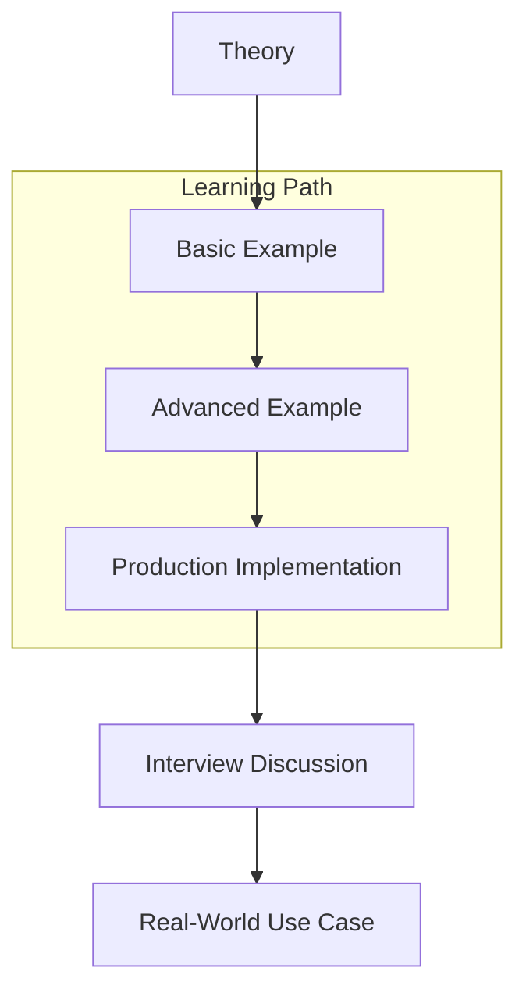

# Interfaces

> **Category:** fundamentals | **Level:** intermediate | **Module:** `09-interfaces`

## Overview

This module covers **Interfaces** — a core topic on the Go Mastery Roadmap from beginner to staff engineer level.

## Learning Objectives

- Understand the theory and mental models behind Interfaces
- Implement production-grade Go code following Clean Architecture and SOLID principles
- Analyze time and space complexity where applicable
- Apply patterns in real-world systems and interviews

## Theory

Interfaces is fundamental to building reliable Go applications. This module progresses from basic concepts to advanced production patterns used at scale.

### Key Concepts

1. **Foundation** — Core syntax, semantics, and idiomatic Go patterns
2. **Advanced Usage** — Edge cases, performance characteristics, and trade-offs
3. **Production Application** — How senior engineers use this in distributed systems

## Visual Diagram



## Complexity Analysis

| Operation | Time | Space | Notes |
|-----------|------|-------|-------|
| Basic     | O(1) | O(1)  | See implementation for details |
| Typical   | O(n) | O(n)  | Varies by use case |

## Code Examples

See `examples/` for runnable code:

- `basic.go` — Minimal introduction
- `advanced.go` — Production patterns
- `main.go` — Runnable demo

Run:

```bash
go run ./09-interfaces/examples/...
```

## Exercises

Complete exercises in `exercises/`:

1. **Exercise 1** — Implement the basic pattern from scratch
2. **Exercise 2** — Add error handling and tests
3. **Exercise 3** — Optimize for production workloads

Solutions are in `exercises/solutions/`.

## Interview Questions

See `interview.md` for curated questions with deep explanations, follow-ups, and production scenarios.

## Production Considerations

See `production.md` for:

- Structured logging with context propagation
- Graceful shutdown and health checks
- Configuration management
- Metrics, tracing, and observability
- Security best practices

## Common Mistakes

See `common-mistakes.md` — pitfalls that cause bugs, performance issues, and failed interviews.

## Best Practices

See `best-practices.md` — idiomatic Go patterns used in production codebases.

## Real-World Use Cases

- **Backend APIs** — REST/gRPC services at scale
- **Distributed Systems** — Microservices, event-driven architectures
- **Infrastructure** — Cloud-native tooling and observability
- **Data Processing** — Pipelines, streaming, and batch workloads

## Related Modules

- Previous: See [150-roadmap](../150-roadmap/README.md) for ordering
- Next: Continue sequentially through the roadmap

## Further Reading

- [Go Documentation](https://go.dev/doc/)
- [Effective Go](https://go.dev/doc/effective_go)
- [Go Blog](https://go.dev/blog/)

---

*Part of [Go Mastery Roadmap](../README.md) — from beginner to staff engineer.*
