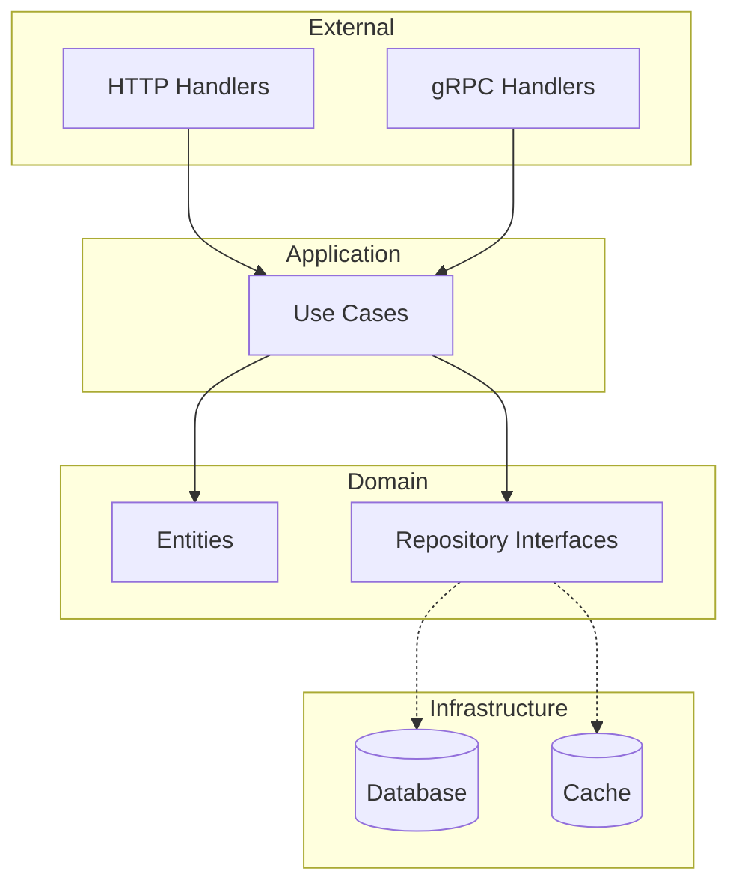

# Repository Pattern — Best Practices

## Idiomatic Go

- Accept interfaces, return structs
- Keep functions small and focused (single responsibility)
- Use table-driven tests
- Prefer composition over inheritance

## Clean Architecture

## SOLID in Go

| Principle | Go Application |
|-----------|----------------|
| Single Responsibility | One package/concern per directory |
| Open/Closed | Extend via interfaces and embedding |
| Liskov Substitution | Interface contracts honored by all impls |
| Interface Segregation | Small, focused interfaces |
| Dependency Inversion | Depend on interfaces in domain layer |

## Testing Strategy

1. **Unit tests** — Pure logic, fast, no I/O
2. **Integration tests** — Real DB/Redis with testcontainers
3. **Benchmarks** — Performance regression detection
4. **Fuzz tests** — Input validation edge cases

## Code Review Checklist

- [ ] Errors handled and wrapped
- [ ] Context propagated
- [ ] No data races
- [ ] Tests cover happy path and edge cases
- [ ] Documentation for exported APIs
