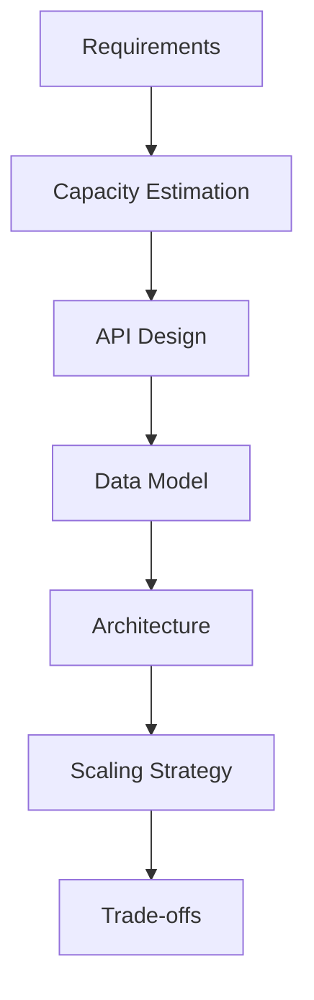
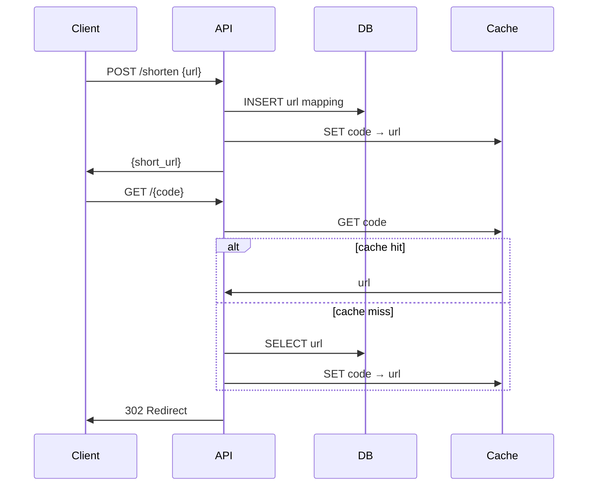

# System Design

Production-ready system design examples with architecture, trade-offs, and Go implementations.

## Projects

| System | Directory | Key Patterns |
|--------|-----------|--------------|
| URL Shortener | [url-shortener/](url-shortener/) | Hashing, caching, read-heavy |
| Rate Limiter | [rate-limiter/](rate-limiter/) | Token bucket, sliding window |
| Distributed Cache | [distributed-cache/](distributed-cache/) | Consistent hashing, TTL |
| Notification System | [notification-system/](notification-system/) | Queue, fan-out, retry |
| Chat Application | [chat-application/](chat-application/) | WebSocket, pub/sub |
| Search Engine | [search-engine/](search-engine/) | Inverted index, ranking |
| Payment Gateway | [payment-gateway/](payment-gateway/) | Idempotency, saga |
| Ride Sharing | [ride-sharing/](ride-sharing/) | Geospatial, matching |
| E-Commerce | [ecommerce/](ecommerce/) | Inventory, orders, CQRS |
| Video Streaming | [video-streaming/](video-streaming/) | CDN, adaptive bitrate |

## Design Framework

## URL Shortener Example

### Requirements

- Shorten URLs to 7-character codes
- 100M URLs/day write, 10B reads/day
- 99.99% availability

### Architecture

See individual project directories for full implementations.
