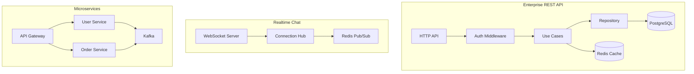

# Production Projects

Four production-grade projects demonstrating enterprise patterns from beginner to staff level.

## Projects

| # | Project | Key Technologies |
|---|---------|-----------------|
| 1 | [Enterprise REST API](project-1-enterprise-api/) | Auth, PostgreSQL, Redis, Docker, CI/CD, metrics |
| 2 | [Realtime Chat](project-2-realtime-chat/) | WebSocket, Redis Pub/Sub, horizontal scaling |
| 3 | [E-Commerce Backend](project-3-ecommerce/) | Payments, inventory, orders, CQRS |
| 4 | [Microservices Platform](project-4-microservices/) | gRPC, Kafka, distributed tracing, Kubernetes |

## Architecture Overview



## Getting Started

Each project has its own README with setup instructions:

```bash
cd project-1-enterprise-api
docker compose up -d
go run ./cmd/server/
```

## Production Checklist

Every project includes:

- [ ] Structured logging with correlation IDs
- [ ] Graceful shutdown
- [ ] Health and readiness probes
- [ ] Prometheus metrics
- [ ] OpenTelemetry tracing
- [ ] Docker multi-stage builds
- [ ] CI/CD pipeline (GitHub Actions)
- [ ] Integration tests
