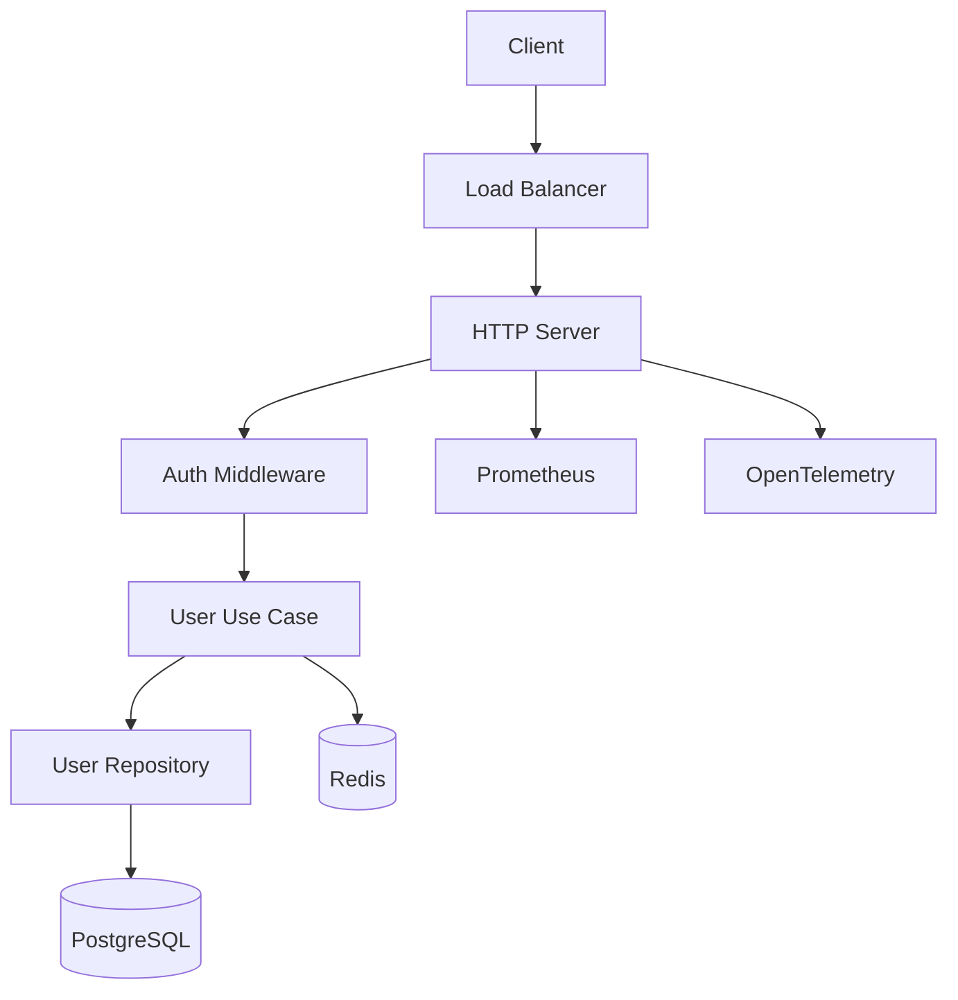

# Enterprise REST API

Production-grade REST API demonstrating Clean Architecture, authentication, PostgreSQL, Redis, Docker, and observability.

## Features

- JWT authentication middleware
- PostgreSQL with repository pattern
- Redis caching layer
- Structured logging (zap)
- Health/readiness probes
- Graceful shutdown
- Docker multi-stage build
- GitHub Actions CI/CD

## Architecture



## Run Locally

```bash
go run ./cmd/server/
curl http://localhost:8080/health
curl http://localhost:8080/api/v1/users
```

## Docker

```bash
docker build -t enterprise-api .
docker run -p 8080:8080 enterprise-api
```

## Environment Variables

| Variable | Default | Description |
|----------|---------|-------------|
| `HTTP_PORT` | 8080 | Server port |
| `SERVICE_NAME` | enterprise-api | Log field |
| `SHUTDOWN_TIMEOUT` | 10s | Graceful shutdown timeout |
