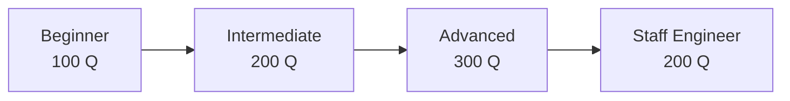

# Interview Preparation

800+ curated Go interview questions organized by level.

## Structure

```
go-interview-questions/
├── beginner/          # 100 questions
├── intermediate/      # 200 questions
├── advanced/          # 300 questions
└── staff-engineer/    # 200 questions
```

## Question Format

Every question includes:

1. **Question** — Clear, interview-realistic prompt
2. **Answer** — Concise correct answer
3. **Deep Explanation** — Under-the-hood details
4. **Follow-up Questions** — What interviewers ask next
5. **Production Scenario** — Real-world application

## Study Path



## Quick Start

```bash
# Browse by level
ls go-interview-questions/beginner/
cat go-interview-questions/beginner/001-variables-and-types.md
```

## Topics Covered

- Language fundamentals (types, interfaces, generics)
- Concurrency (goroutines, channels, memory model)
- Data structures and algorithms
- System design and distributed systems
- Databases and SQL
- Networking and HTTP
- Security and authentication
- Testing and observability
- Architecture patterns (Clean Architecture, DDD, CQRS)
- Production debugging and performance

## Sample Question

See [go-interview-questions/beginner/001-variables-and-types.md](go-interview-questions/beginner/001-variables-and-types.md)
