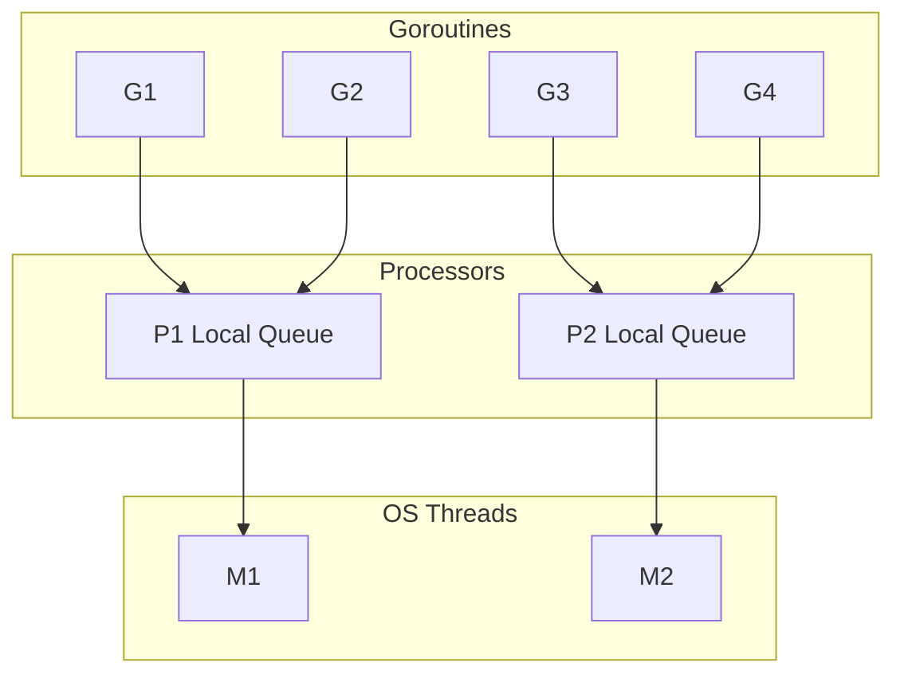

# Q1: Explain the Go scheduler GMP model.

## Answer

Go uses a hybrid M:N scheduler: **G** (goroutines) are multiplexed onto **M** (OS threads) via **P** (processors/contexts). Each P maintains a local run queue of Gs. When a G blocks on I/O, the M releases P and another M picks up P to run other Gs.

## Deep Explanation

- **G** — Goroutine: lightweight (~2KB stack, growable)
- **M** — Machine: OS thread executing Go code
- **P** — Processor: scheduling context; `GOMAXPROCS` controls count

**Work stealing:** When P's local queue is empty, it steals Gs from other Ps' queues or the global queue.

**Syscall handling:** When G enters a blocking syscall, M detaches from P so P can continue scheduling other Gs on a different M.

## Follow-up Questions

- What happens when `GOMAXPROCS=1`?
- How does the network poller integrate with the scheduler?
- Why can `runtime.GOMAXPROCS(0)` be called without side effects?

## Production Scenario

Your service handles 50K concurrent WebSocket connections. Each connection is a goroutine (~100MB total stack vs 50K threads which would exhaust memory). Monitor `runtime.NumGoroutine()` and set alerts when goroutine count grows unbounded — often indicating connection leaks or missing context cancellation.
