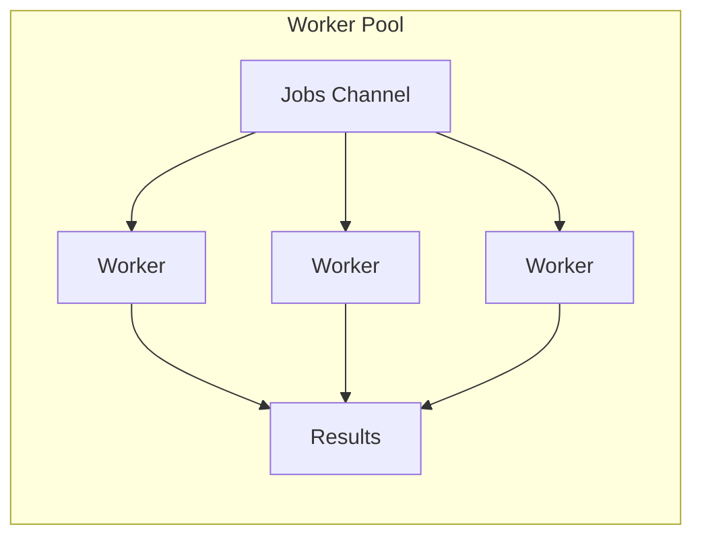

# Cheat Sheets

Quick-reference guides for interviews and daily development.

## Available Cheat Sheets

| Sheet | File | Topics |
|-------|------|--------|
| Go Syntax | [go-syntax.md](go-syntax.md) | Types, control flow, functions, interfaces |
| Concurrency | [concurrency.md](concurrency.md) | Goroutines, channels, sync, patterns |
| SQL | [sql.md](sql.md) | Queries, indexes, transactions, optimization |
| Kubernetes | [kubernetes.md](kubernetes.md) | Pods, services, deployments, probes |
| System Design | [system-design.md](system-design.md) | CAP, scaling, caching, load balancing |
| Algorithms | [algorithms.md](algorithms.md) | Sorting, searching, DP, graph algorithms |

## Go Syntax Quick Reference

```go
// Variable declaration
var x int = 10
y := 20

// Function with multiple returns
func divide(a, b int) (int, error) {
    if b == 0 {
        return 0, errors.New("division by zero")
    }
    return a / b, nil
}

// Interface (implicit satisfaction)
type Reader interface {
    Read(p []byte) (n int, err error)
}

// Goroutine + channel
ch := make(chan int, 10)
go func() { ch <- 42 }()
v := <-ch

// Defer (LIFO cleanup)
f, _ := os.Open("file.txt")
defer f.Close()

// Context with timeout
ctx, cancel := context.WithTimeout(context.Background(), 5*time.Second)
defer cancel()
```

## Concurrency Patterns



See individual cheat sheets for complete references.
