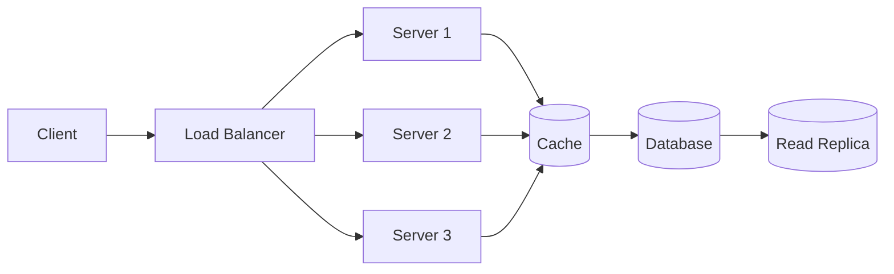

# System Design Cheat Sheet

## CAP Theorem

Pick 2 of 3 under partition:

| | Consistency | Availability | Partition Tolerance |
|---|-------------|--------------|-------------------|
| CP | ✓ | ✗ | ✓ |
| AP | ✗ | ✓ | ✓ |
| CA | ✓ | ✓ | ✗ (single node only) |

## Consistency Models

| Model | Description | Example |
|-------|-------------|---------|
| Strong | All reads see latest write | Spanner, etcd |
| Eventual | Reads eventually consistent | DynamoDB, Cassandra |
| Causal | Causally related ops ordered | MongoDB |
| Read-your-writes | User sees own writes | Session stickiness |

## Scaling Patterns



## Caching Strategies

| Strategy | Description |
|----------|-------------|
| Cache-aside | App reads cache, falls back to DB |
| Write-through | Write to cache and DB synchronously |
| Write-behind | Write to cache, async flush to DB |
| Read-through | Cache loads from DB on miss |

## Rate Limiting

| Algorithm | Pros | Cons |
|-----------|------|------|
| Token Bucket | Allows bursts | Memory per client |
| Sliding Window | Smooth rate | More memory |
| Fixed Window | Simple | Boundary spikes |
| Leaky Bucket | Smooth output | No bursts |

## Back-of-Envelope

```
1 day = 86400 seconds ≈ 10⁵ seconds
1 million requests/day ≈ 12 req/sec
1 billion requests/day ≈ 12K req/sec
1 KB × 1M = 1 GB
1 KB × 1B = 1 TB
```

## Common Components

| Component | Options |
|-----------|---------|
| Load Balancer | NGINX, HAProxy, AWS ALB |
| Cache | Redis, Memcached |
| Database | PostgreSQL, MySQL, Cassandra |
| Queue | Kafka, RabbitMQ, SQS |
| Search | Elasticsearch |
| Object Storage | S3, MinIO |
| CDN | CloudFront, Cloudflare |

## Interview Framework

1. **Requirements** — functional + non-functional (latency, availability, scale)
2. **Estimation** — QPS, storage, bandwidth
3. **API Design** — REST endpoints, request/response
4. **Data Model** — schema, indexes, sharding key
5. **Architecture** — components, data flow
6. **Deep Dive** — bottlenecks, scaling, failure modes
7. **Trade-offs** — what you'd change with 10x scale
