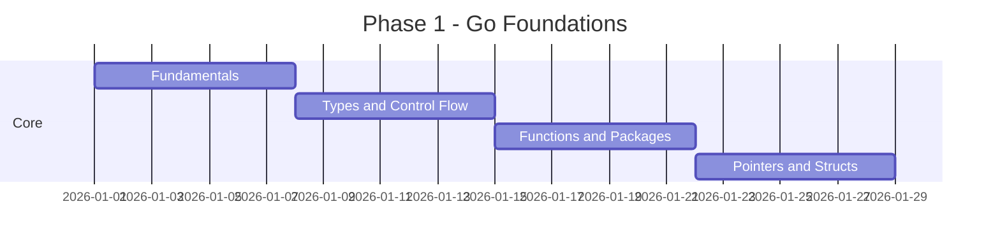

# Learning Roadmap

Complete path from Go beginner to staff / distributed systems engineer.

## Phase 1: Foundations (Weeks 1–4)

**Modules:** 01–12

| Module | Topic | Outcome |
|--------|-------|---------|
| 01 | Fundamentals | Write basic Go programs |
| 02 | Type System | Understand static typing |
| 06 | Pointers | Manage memory references |
| 09 | Interfaces | Polymorphism in Go |
| 10 | Generics | Type-safe reusable code |
| 11 | Error Handling | Idiomatic error patterns |
| 12 | Memory Management | GC, stack vs heap |

## Phase 2: Data Structures (Weeks 5–8)

**Modules:** 13–30

Build every structure from scratch. Focus on complexity analysis and when to use each in production.

## Phase 3: Algorithms (Weeks 9–12)

**Modules:** 31–48

Master sorting, searching, DP, graph algorithms. Practice on LeetCode using Go.

## Phase 4: Concurrency (Weeks 13–16)

**Modules:** 49–64

Deep dive into goroutines, channels, memory model, race conditions, and production concurrency patterns.

## Phase 5: Backend Engineering (Weeks 17–24)

**Modules:** 65–102

| Area | Modules |
|------|---------|
| I/O & Serialization | 65–70 |
| Networking | 71–82 |
| Databases | 83–93 |
| Security | 94–102 |

## Phase 6: Production Engineering (Weeks 25–32)

**Modules:** 103–130

Testing, architecture patterns, observability, Docker, Kubernetes, CI/CD, Terraform.

## Phase 7: Distributed Systems (Weeks 33–40)

**Modules:** 131–146

Messaging, design patterns, system design, CAP theorem, Raft, caching, rate limiting.

## Phase 8: Capstone (Weeks 41–48)

**Modules:** 147–150

- Build all 4 production projects
- Complete 800 interview questions
- Review cheat sheets

## Skill Matrix

| Level | Modules | Can Build |
|-------|---------|-----------|
| Beginner | 01–12 | CLI tools, scripts |
| Developer | 13–48 | Algorithms, data processing |
| Backend Engineer | 49–102 | REST APIs, databases |
| Senior Engineer | 103–130 | Production services, K8s |
| Staff Engineer | 131–150 | Distributed platforms |

## Weekly Study Plan

| Day | Activity | Time |
|-----|----------|------|
| Mon–Thu | Read module + run examples | 1 hr |
| Fri | Complete exercises | 1.5 hr |
| Sat | Interview questions | 1 hr |
| Sun | Build mini-project | 2 hr |

## Progress Tracking

- [ ] Phase 1: Foundations
- [ ] Phase 2: Data Structures
- [ ] Phase 3: Algorithms
- [ ] Phase 4: Concurrency
- [ ] Phase 5: Backend Engineering
- [ ] Phase 6: Production Engineering
- [ ] Phase 7: Distributed Systems
- [ ] Phase 8: Capstone

Start with [01-fundamentals](../01-fundamentals/README.md).
