# Go Mastery Roadmap

A comprehensive, production-oriented learning path that takes you from **absolute Go beginner** to **staff / distributed systems engineer**.

Every topic lives in its own numbered folder with theory, diagrams, runnable code, exercises, interview questions, and production guidance.

## Progression Path

```mermaid
flowchart LR
    A[Beginner<br/>01-12] --> B[Data Structures<br/>13-30]
    B --> C[Algorithms<br/>31-48]
    C --> D[Concurrency<br/>49-64]
    D --> E[IO & Networking<br/>65-82]
    E --> F[Databases<br/>83-93]
    F --> G[Security<br/>94-102]
    G --> H[Testing & Observability<br/>103-124]
    H --> I[Cloud Native<br/>125-135]
    I --> J[Architecture & Systems<br/>136-146]
    J --> K[Production Projects<br/>147]
    K --> L[Interview Prep<br/>148-150]
```



## Repository Structure

| Range | Topic Area |
|-------|-----------|
| 01–12 | Go fundamentals |
| 13–30 | Data structures (from scratch) |
| 31–48 | Algorithms & complexity |
| 49–64 | Concurrency mastery |
| 65–70 | File I/O & serialization |
| 71–82 | Networking |
| 83–93 | Databases |
| 94–102 | Security |
| 103–110 | Testing, benchmarks, profiling |
| 111–118 | Architecture patterns |
| 119–124 | Logging & observability |
| 125–130 | Cloud-native & IaC |
| 131–135 | Messaging & streaming |
| 136–146 | Design patterns & distributed systems |
| 147 | Production projects |
| 148 | Interview preparation |
| 149 | Cheat sheets |
| 150 | Master roadmap |

## Quick Start

```bash
# Clone and enter the repo
git clone https://github.com/go-mastery-roadmap/go-mastery-roadmap.git
cd go-mastery-roadmap

# Download dependencies
go mod download

# Run a module example
go run ./01-fundamentals/examples/

# Run all tests
go test ./...

# Run tests with race detector
go test -race ./...

# Run benchmarks
go test -bench=. ./18-linked-lists/ ./31-sorting/
```

## Module Structure

Every module folder contains:

| File / Directory | Purpose |
|------------------|---------|
| `README.md` | Theory, diagrams, learning objectives |
| `examples/` | Basic, advanced, and runnable demos |
| `exercises/` | Hands-on exercises with solutions |
| `interview.md` | Interview Q&A with follow-ups |
| `production.md` | Production considerations |
| `common-mistakes.md` | Pitfalls to avoid |
| `best-practices.md` | Idiomatic patterns |
| `diagrams/` | Mermaid source diagrams |

Data structure and algorithm modules additionally include:

- `implementation.go` — from-scratch implementation
- `implementation_test.go` — unit tests
- `benchmarks_test.go` — performance benchmarks

## Production Standards

All code demonstrates:

- **Go 1.24+** with idiomatic patterns
- **Clean Architecture** and **SOLID** principles
- Structured logging (`pkg/logger`)
- Context propagation and graceful shutdown
- Error wrapping (`pkg/apperrors`)
- Health checks (`pkg/health`)
- Unit tests, benchmarks, and race detection

## Shared Packages

```
pkg/
├── apperrors/   # Structured application errors
├── config/      # Environment-based configuration
├── health/      # Liveness/readiness probes
├── logger/      # Zap structured logging
└── shutdown/    # Graceful shutdown helpers
```

## Production Projects (Module 147)

1. **Enterprise REST API** — Auth, PostgreSQL, Redis, Docker, CI/CD, metrics, tracing
2. **Realtime Chat** — WebSocket, Redis Pub/Sub, horizontal scaling
3. **E-Commerce Backend** — Payments, inventory, orders, CQRS
4. **Microservices Platform** — gRPC, Kafka, distributed tracing, Kubernetes

## Interview Preparation (Module 148)

800+ curated questions across four levels:

- Beginner (100)
- Intermediate (200)
- Advanced (300)
- Staff Engineer (200)

## Cheat Sheets (Module 149)

Quick-reference guides for Go syntax, concurrency, SQL, Kubernetes, system design, and algorithms.

## Contributing

1. Pick a module from [150-roadmap](150-roadmap/README.md)
2. Follow the existing structure and production standards
3. Ensure `go test ./...` passes
4. Submit a pull request

## License

MIT License — see [LICENSE](LICENSE).

---

**Start here:** [01-fundamentals](01-fundamentals/README.md) → [150-roadmap](150-roadmap/README.md)
